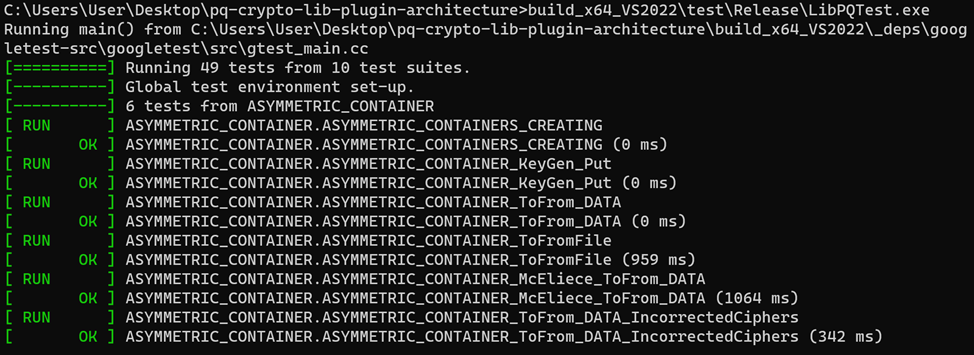

# Getting started
{: .no_toc }

<details open markdown="block">
  <summary>
    Table of contents
  </summary>
  {: .text-delta }
1. TOC
{:toc}
</details>

## Quickstart

### Windows

The guide provides instructions on how to download the latest TQ42 Cryptography
sources from the following link: [TQ42 Cryptography
Library](https://github.com/terra-quantum-public/tq42-pqc-oss) and
build a DLL for Windows.

Here are the steps:

**Step 1 - Retrieve the source code**

* Using Git command line:


    1. Install Git console for Windows from <https://git-scm.com/downloads>.

    2.  run CMD.

    ``` 
    git clone -b main https://github.com/terra-quantum-public/tq42-pqc-oss.git 
    cd tq42-pqc-oss
    ```

* Alternatively, download the source code directly from GitHub as a ZIP file:


    1. Go to the repository and click on the \"Code\" button.
    2. Select \"Download ZIP\".
    3. Unpack the downloaded archive and open CMD inside the tq42-pqc-oss folder.

**Step 2 - Building the Library using Visual Studio**

* To build the library, ensure that Visual Studio is installed. TQ42 Cryptography offers
two automatic builders for Visual Studio 2019 and Visual Studio 2022.

* **Before Starting the Build Process** Ensure that you have a stable
internet connection.

* **Executing the Build** Run the `win_build_22.bat` file or `win_build_19.bat`, depending on Visual Studio version.

**Step 3 - Testing**

* Upon successful build, a new folder will be created: `build_x64_VS2022`
(or `build_x64_VS2019`). Inside this folder, you will find the following
important artifacts:

    1.  `pqc.sln`: Full Visual Studio solution
    2.  `pqc.lib` at `build_x64_VS2022\src\Release`
    3.   Project test at `build_x64_VS2022\test\Release\LibPQTest.exe`

*  To run the test, follow these steps:
    -   Open CMD.
    -   Navigate to `build_x64_VS2022\test\Release\`.
    -   Run `LibPQTest.exe` Ensure that all tests are passed for the
        expected results.



**Step 4 - Linking Headers**

* Link the headers from the \"include\" folder and `pqc.lib` to your
project. When working with the Visual Studio project, make sure to change the version to \"Release\".

Additionally, you can open the project in Visual Studio. Set one of the projects as the \"run
project\". For example, you can achieve this with `LibPQTest` and work
with source files in Visual Studio.

### Linux

* The guide outlines the process for downloading the latest TQ42 Cryptography sources
from the TQ42 Cryptography Library link and building it for
Linux. Here are the detailed steps:

**Step 1 - Retrieve the Source Code**

- Using Git command line:

    1.  Install Git console for Linux from
    <https://git-scm.com/book/en/v2/Getting-Started-Installing-Git>

    2. Run the following commands:

    > ``` 
    > git clone -b main https://github.com/terra-quantum-public/tq42-pqc-oss.git
    > cd tq42-pqc-oss
    > ```

- Alternatively, download the source code directly from GitHub as a ZIP
file:

    1. Go to the repository and click on the \"Code\" button, then select "Download ZIP\".

    2. Unpack the downloaded archive and open a terminal inside the tq42-pqc-oss folder.

Step 2 - Building the Library

* To build the project, run the following commands:

``` 
cd build
cmake --build 
```

**Step 3 - Artifacts**

* After building TQ42 Cryptography, there are several artifacts:

* To run the tests, navigate to the test folder and run the tests:

``` 
cd test
./LibPQTest
```

* The library file can be found in the \"src\" folder named pqc.a. The
headers are located in the \"include\" folder of the original git
archive and can be used as a standard library for linking with a
project.
