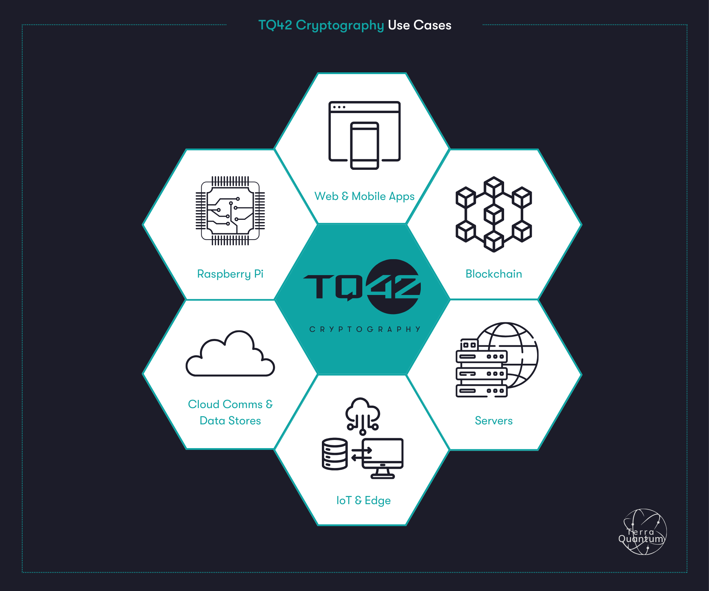
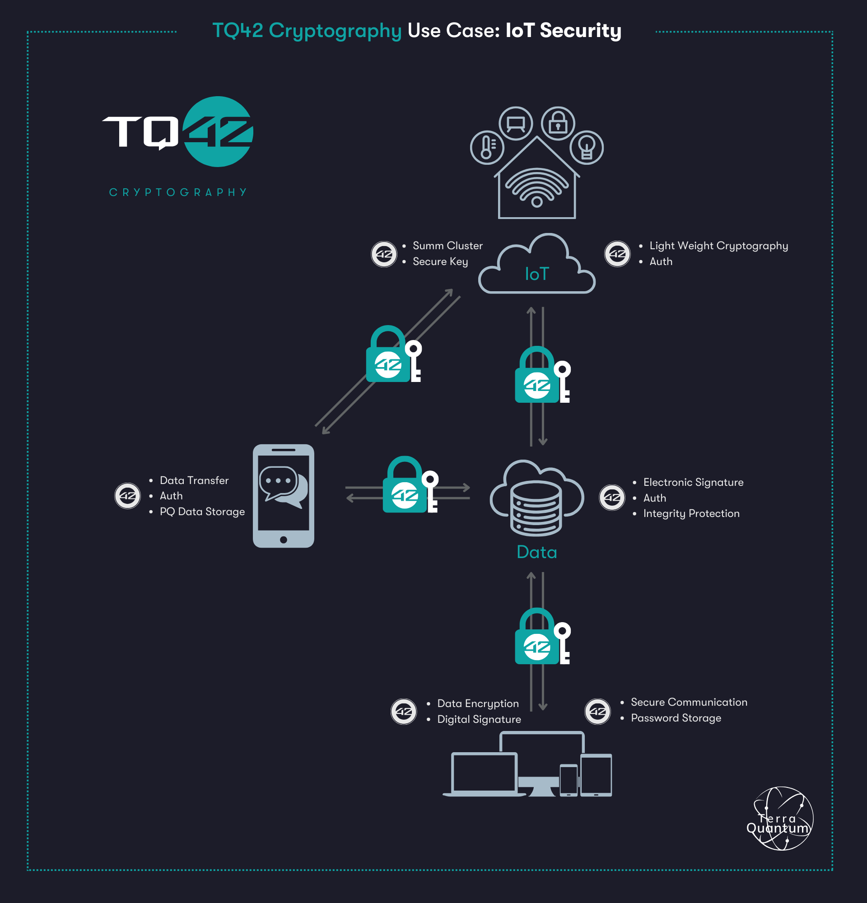
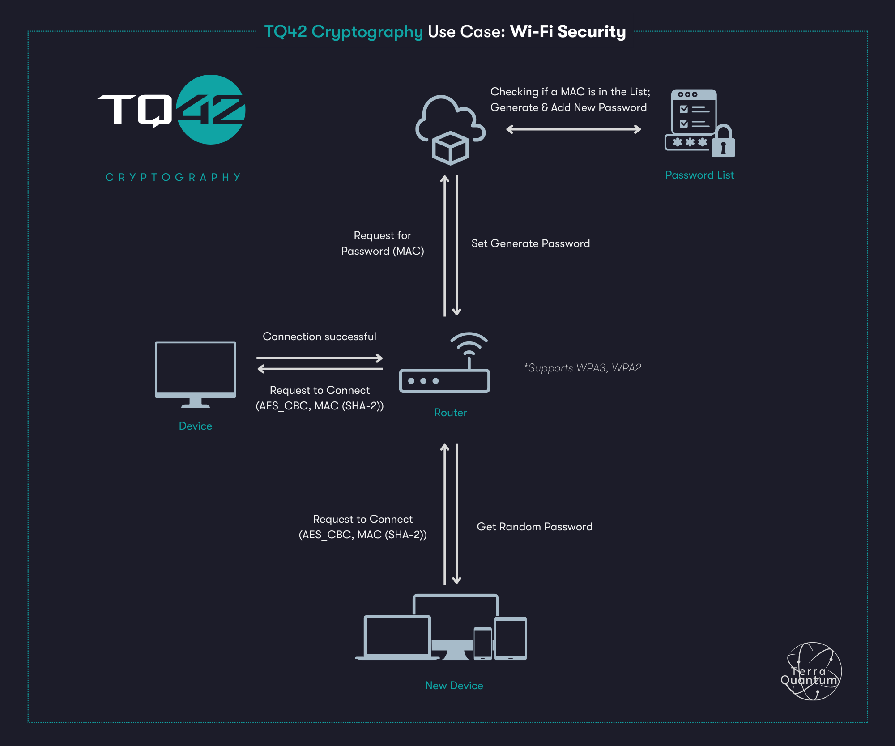
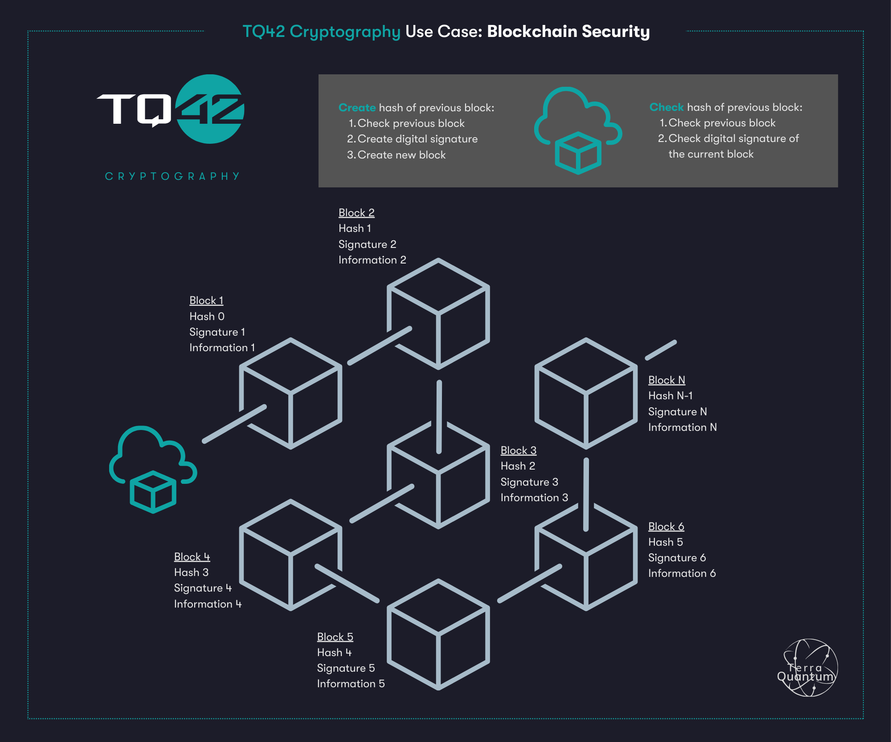
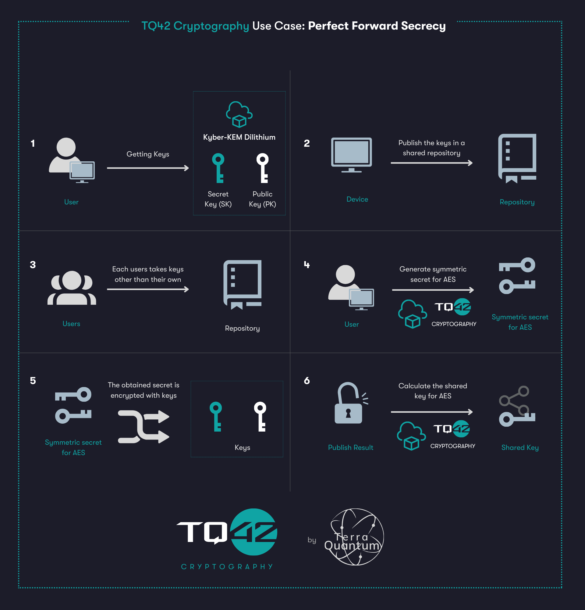

# Overview
{: .no_toc }

  

    Table of contents
  

  {: .text-delta }
1. TOC
{:toc}

TQ42 Cryptography encompasses a wide range of applications and algorithms tailored to counteract the threat of quantum computing to traditional cryptographic systems. TQ42 Cryptography can be implemented across diverse platforms such as mobile, web applications, IoT, cloud, blockchain, Raspberry Pi and others. This page provides some examples and ideas to help you get started.

## Use Cases

#### Encryption

-   **Communication Security**: Protects communication channels like VPNs, secure email protocols such as S/MIME, and secure messaging applications.
-   **Data Storage**: Secures data at rest in databases, file systems, and backups.
-   **Cloud Security**: Encrypts data in cloud storage and computing services.

#### Electronic Signature

-   **Document Signing**: Validates electronic documents, contracts, and agreements.
-   **Software Distribution**: Assures the authenticity and integrity of software updates.
-   **Code Signing**: Verifies the origin and integrity of software code.  
-   **Data Integrity Checking**: Utilizes cryptographic hashing to ensure data integrity.

#### Authentication

-   **Password Hashing**: Secures authentication systems and user credentials.
-   **Symmetric Key Authentication**: Authenticates users through symmetric key hash calculation.   
-   **Electronic Signature Authentication**: Authenticates users through electronic signature verification.  

### Smart Home Automation

**Problem**: Quantum computers have the potential to **pose security risks** to smart home automation systems. One of the most significant concerns is the ability of quantum computers to efficiently break traditional cryptographic algorithms, such as RSA and ECC, which are widely used for securing data transmission, storage, and authentication.

**Solution**

Platforms involved: Mobile devices, Cloud, Web Platform, IoT

In a smart home automation setting, a mobile application allows the user to control IoT devices, including appliances like refrigerators, vacuum cleaners, and lighting systems. All data and analytics are stored on a web interface, and communication flows through the cloud.

Key highlights of the implementation include:

-   **Encryption** between mobile devices and IoT sensors to ensure data security and privacy.
    
-   **Secure communication** between the mobile app and the backend in the cloud through an encrypted channel, providing a protected data exchange.
    
-   The cloud server **securely transmits data** to the IoT devices, maintaining the integrity and confidentiality of the information flow.
    
-   All communication **channels are encrypted**, and each component within the system is authenticated, reinforcing the overall security posture of the smart home automation ecosystem.

The same scenario can be applied for Industrial Automation, Agricultural Drones, Search and Rescue Drones, Environmental Monitoring, and Delivery Drones.

### Wi-Fi & TQ42 Cryptography

In the **Wi-Fi** example, TQ42 Cryptography can be used to generate passwords when working with the router. The Wi-Fi password is also used as an encryption key if the router is properly configured. To offset the efforts to intercept Wi-Fi packets with the same keys, a router can be used that (by administrator command) would create a unique password for a new device (new MAC). In the future, the administrator command can be replaced by QR-code connection.  
In addition, TQ42 Cryptography can be used to encrypt the password file and generate a key from the administrator password to encrypt files using **pbrdf2**.

### Blockchain & TQ42 Cryptography

In the **Blockchain** example, TQ42 Cryptography is used for digital signatures and hashing. A blockchain is a structure of linked blocks of any information. The connection is made by the fact that the next block contains the hash/digital signature of the previous block. Result - any change in the already written blocks requires recalculation of all hashes of all blocks going forward. For example, the same bitcoin requires a special number to be added to a block such that the hash starts with N zeros, which makes it difficult to find such a hash and requires a large number of retries.  
The diagram shows one of the options for building a blockchain based on TQ42 Cryptography.

### PFS & TQ42 Cryptography

In the example **Perfect Forward Secrecy (PFS)** example, TQ42 Cryptography is used in such a way that each node contributes its share of entropy to the overall symmetric session key. None of the nodes forward the final encryption key in its entirety, and no one from outside can learn the session key by breaking the long-term keys incompletely (n-1 broken keys will not yield the session key).

In the above example, we can integrate TQ42 Cryptography into the overall PFS scheme. To start information sharing, the user obtains keys (TQ42 Cryptography), which are then put into a shared repository where each user must retrieve them. Once the keys are obtained and the shared key is computed, the information sharing between users will be considered secure.
